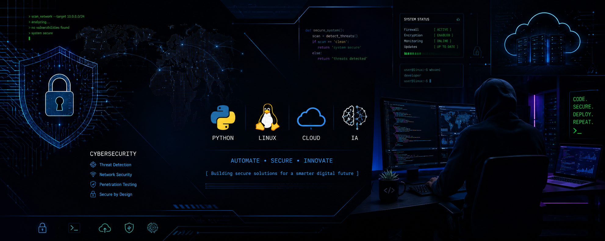

<p align="center">
  
</p>

# 👋 Olá, eu sou Cristiano Bonifácio

### 🎓 Estudante de TI | 🔐 Cybersecurity | 🐧 Linux | 🌐 Redes | 🐍 Python

Sou estudante de Tecnologia da Informação e estou no início da minha formação, construindo minha base em **Linux, Redes, Python e Segurança da Informação**.

Meu objetivo é desenvolver conhecimentos técnicos de forma gradual, através de estudos, exercícios e pequenos projetos práticos.

---

## 🔐 Sobre meu foco

Atualmente estou direcionando meus estudos para:

* 🛡️ Fundamentos de Cybersecurity
* 🐧 Linux
* 🌐 Redes de Computadores
* 🐍 Python
* 🔧 Git e GitHub
* 💻 Fundamentos de Tecnologia da Informação

Ainda estou no início da jornada e meu foco neste momento é **aprender bem os fundamentos antes de avançar para conteúdos mais complexos**.

---

## 🧰 Tecnologias que estou estudando

**Sistemas**

`Linux` `Windows`

**Redes**

`TCP/IP` `DNS` `HTTP/HTTPS` `SSH`

**Programação**

`Python` `Java`

**Segurança**

`Fundamentos de Cybersecurity` `Segurança de Redes`

**Ferramentas**

`Git` `GitHub` `VirtualBox`

---

## 🚀 Projetos e estudos

Alguns dos assuntos que venho estudando e praticando:

🔐 **Fundamentos de Segurança da Informação**
Conceitos básicos de segurança, autenticação, controles de segurança e outros fundamentos.

🌐 **Segurança de Redes de Computadores**
Estudos sobre redes, comunicação, ameaças e conceitos básicos de proteção.

🐧 **Linux Basics**
Comandos, arquivos, permissões, usuários, processos e fundamentos de administração.

🐍 **Python Security Basics**
Pequenos exercícios em Python relacionados a programação, redes e conceitos básicos de segurança.

☕ **Orientação a Objetos em Java**
Estudos dos fundamentos de programação orientada a objetos.

---

## 🎓 Formação

**Tecnologia em Gestão da Segurança e Defesa Cibernética — UNINTER**
Cursando

**Tecnólogo em Computação em Nuvem — Anhanguera**
Cursando

**Tecnólogo em Gestão Comercial — FMU**
Concluído

---

## 📚 Atualmente aprendendo

```text
Linux
  ↓
Redes
  ↓
Python
  ↓
Segurança da Informação
  ↓
Cybersecurity
```

Meu objetivo é evoluir passo a passo e, futuramente, conquistar minha primeira oportunidade de estágio na área de Tecnologia e Cybersecurity.

---

## 🤝 Contato

💼 [LinkedIn](https://www.linkedin.com/in/adamasnegro/)

---

> **Aprender os fundamentos. Praticar. Documentar. Evoluir.**
